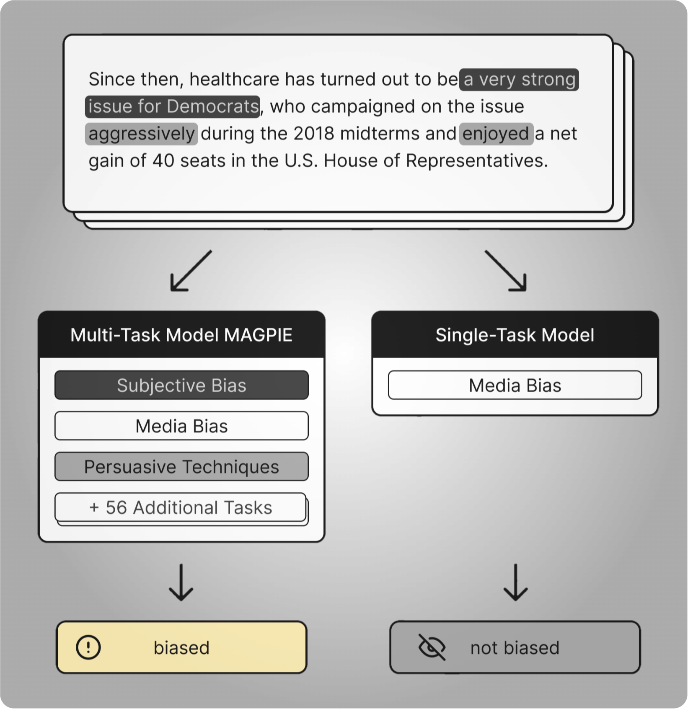
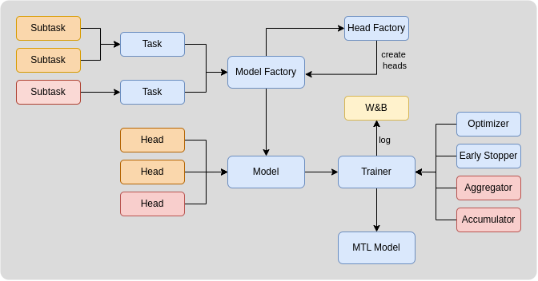

# MAGPIE: Multi-Task Media-Bias Analysis of Generalization of Pre-Trained Identification of Expressions

This repository contains all resources from the paper "MAGPIE: Multi-Task Media-Bias Analysis of Generalization of Pre-Trained Identification of Expressions". MAGPIE is the first large-scale multi-task learning (MTL) approach for detecting media bias. To train MAGPIE the LBM (Large Bias Mixture), a comprehensive pre-training composition of 59 bias-related tasks encompassing linguistic bias, gender bias, group bias, and others is introduced.




[1. Getting started](#1-getting-started)

[2. MTL Framework](#2-mtl-framework)
  * [1. Datasets](#datasets)
  * [2. Training](#training)
   

[3. Reproduce the results](#3-reproduce-the-results)

[4. Run your experiments](#4-run-your-experiments)

[5. Citation](#5-citation)
<br clear="right"/>


# 1. Getting started
## Install python dependencies

In order to be able to use the framework or run an inference, please first install python dependencies via following:
```
pip install -r requirements.txt
```
## wandb.ai API Access
Our training framework uses Weights&Biases to track all experiments. Please add your API KEY to `local.env` file. You can get your API KEY for free at [wandb.ai](https://wandb.ai/home).

# 2. MTL Framework
This repository contains code for training models in a multi-task learning fashion through the MTL framework.

## Datasets
We make our Large Bias Mixture (LBM) collection available in [datasets directory](/datasets/). All datasets are in processed and cleaned state. Each datasets has acording preprocessor class under [preprocessing directory](/preprocessing/) and according script for preprocessing under [scripts/preprocessors](/scripts/preprocessors/) directory. However, preprocessing concerns the raw data, that can be found under our huggingface repository `PLACEHOLDER FOR ANONYMOUS SUMBISSION`.

## Training
```
├─ training
     |
     ├─── data
     |
     ├─── model
     |    └─── optimization
     |    
     ├─── trainer
     |
     └─── tokenizer
          └─── mb-mtl-tokenizer
```
Training subdirectory consists of three main components:
- `data` directory contains data structures
- `model` directory contains definition of model architecture and classes for gradient manipulation.
- `trainer` contains a main `trainer.py` class which orchestrates the whole multi-task training.

For further details please refer to [training directory](/training/).

# 3. Reproduce the results
All experiments can be reproduced via running scripts in [scripts directory](/scripts/). Each subdirectory in `scripts/` has a `run_experiment.py` file defining the whole experiment.
- `scripts/ablation_study/` contains an evaluation of `HSES` and `Resurrection` optimization strategies
- `scripts/gradts_task_selection` contains four-step pipeline for selecting the auxiliary tasks based on GradTS algorithm
- `scripts/hyperparameter_tuning` contains hyperparameter search for option for robust selection of hyperparameters
- `scripts/lbm_taxonomy_analysis` contains a script for co-training tasks based on task families
- `scripts/evaluation_robust` contains final MAGPIE evaluation over 30 random seeds

# 4. Run your experiments
Running your own experiments can be done on multiple degrees of customization. You can customize the training based on the adjustments listed below

1. Add your own datasets/tasks
   - put your dataset into `/datasets/YOUR_DATASET/` folder
   - define your dataset as a learning task in [training initialization file](/training/data/__init__.py)
2. Define your own task-specific head in [model heads class](/training/model/head.py). Classification, Regression and Language Modelling tasks are implemented
3. Choose encoder-only model of your choice and define it in `enums/model_checkpoints`
4. Adjust the fixed training parameters (e.g., MAX_NUMBER_OF_STEPS, random seed, etc.) in `config.py` 
5. Write your own execution script choosing desired training parameters. An example:
   ```python
    import wandb
    from config import head_specific_lr, head_specific_max_epoch, head_specific_patience
    from enums.aggregation_method import AggregationMethod
    from enums.model_checkpoints import ModelCheckpoint
    from enums.scaling import LossScaling
    from training.data import YOUR_TASK_A,YOUR_TASK_B,YOUR_TASK_C
    from training.model.helper_classes import EarlyStoppingMode, Logger
    from training.trainer.trainer import Trainer
    from utils import set_random_seed

    EXPERIMENT_NAME = "EXPERIMENT NAME"


    tasks = [YOUR_TASK_A,YOUR_TASK_B,YOUR_TASK_C]

    for t in tasks:
      for st in t.subtasks_list:
          st.process()

    config = {
      "sub_batch_size": 32,
      "eval_batch_size": 128,
      "initial_lr": 4e-5,
      "dropout_prob": 0.1,
      "hidden_dimension": 768,
      "input_dimension": 768,
      "aggregation_method": AggregationMethod.MEAN,
      "early_stopping_mode": EarlyStoppingMode.HEADS,
      "loss_scaling": LossScaling.STATIC,
      "num_warmup_steps": 10,
      "pretrained_path": None,
      "resurrection": True,
      "model_name": "YOUR_MODEL_NAME",
      "head_specific_lr_dict": head_specific_lr,
      "head_specific_patience_dict": head_specific_patience,
      "head_specific_max_epoch_dict": head_specific_max_epoch,
      "logger": Logger(EXPERIMENT_NAME),
    }


    set_random_seed() # default is 321
    wandb.init(project=EXPERIMENT_NAME,name="YOUR_MODEL_NAME")
    trainer = Trainer(task_list=tasks, LM=ModelCheckpoint.ROBERTA, **config)
    trainer.fit()
    trainer.eval(split=Split.TEST)
    trainer.save_model()
    wandb.finish()

   ```


# 3. Citation
Please cite us as:
```
```
